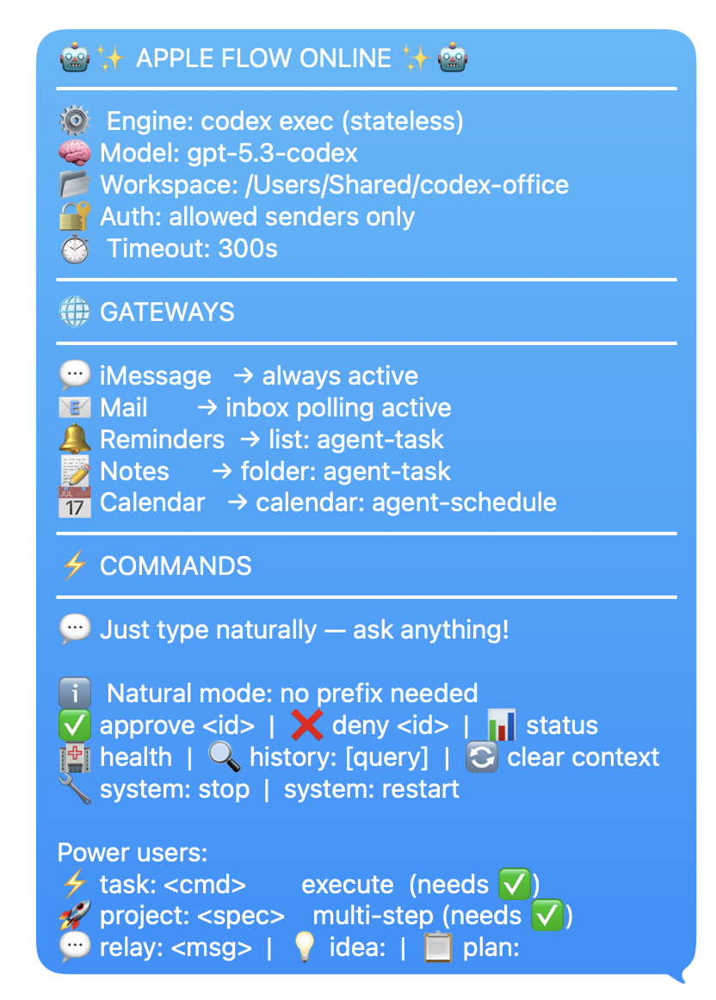
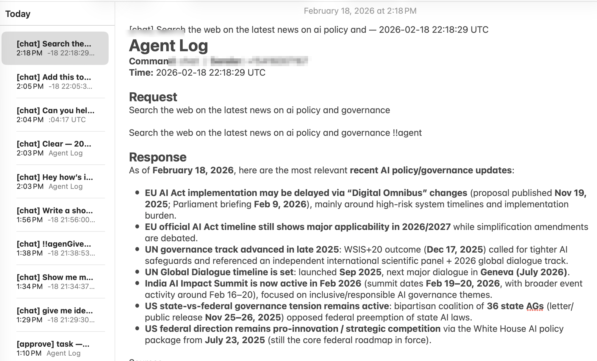
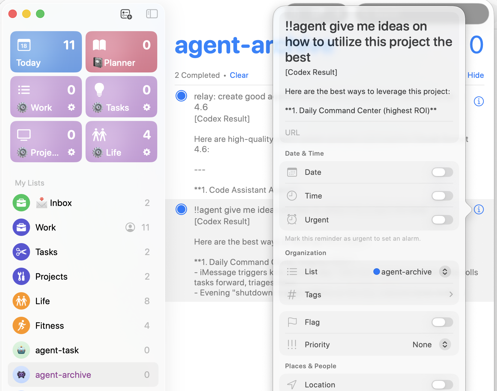
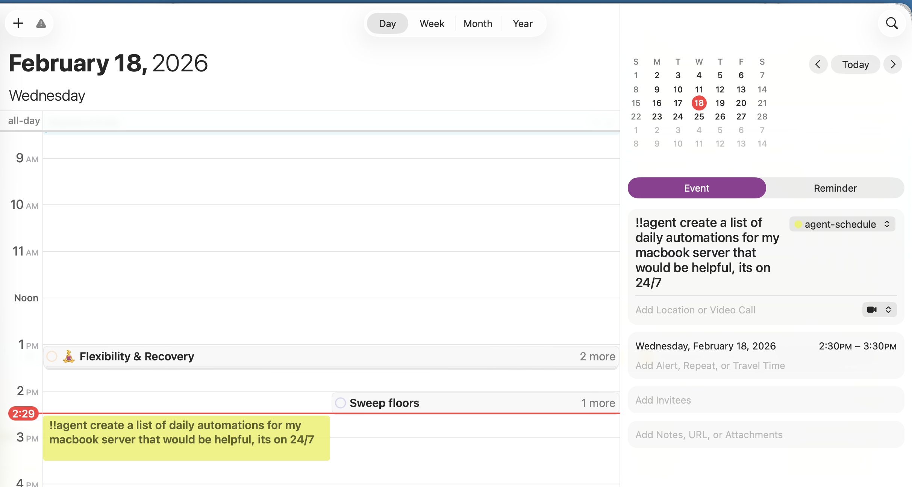
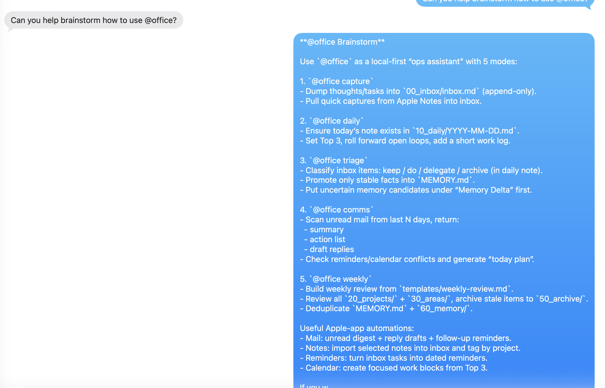

<div align="center">

# 🍎 Apple Flow

**Your Apple-Native AI Assistant**

*Control AI w/ your Apple Apps. Get things done.*

[](https://opensource.org/licenses/MIT)
[](https://www.python.org/downloads/)
[](https://www.apple.com/macos)
[](https://github.com/dkyazzentwatwa/apple-flow/releases)

**[apple-flow-site.vercel.app](https://apple-flow-site.vercel.app/)**

*A local-first macOS daemon that bridges iMessage, Mail, Reminders, Notes, and Calendar to your favorite AI assistant. No apps. No cloud. Just your Apple Apps.*

</div>

---

## ✨ What is Apple Flow?

Apple Flow turns your Apple apps into an AI command center. Interact through any of these gateways:

### 💬 Chat Gateways
| Gateway | How it works |
|---------|--------------|
| **iMessage** | Text yourself — no bot tokens, no setup beyond Full Disk Access |
| **Apple Mail** | Send emails to your AI, get replies in your inbox |

### 📥 Task Ingress (Create tasks from Apple apps)
| Gateway | How it works |
|---------|--------------|
| **Apple Reminders** | Add a reminder → becomes a task for AI |
| **Apple Notes** | Tag a note with `!!agent` → AI processes it |
| **Apple Calendar** | Create an event → AI executes when it's due |

### 📤 Response & Logging
| Gateway | How it works |
|---------|--------------|
| **iMessage** | All AI responses sent here by default |
| **Apple Notes** | Optional: log every AI response as a new note |

### 🤖 Proactive Companion
Your AI companion watches your life and sends proactive iMessage updates:
- ⏰ **Stale approvals** — "Hey, you have a task waiting for approval"
- 📅 **Upcoming events** — "Meeting in 30 minutes"
- 🔔 **Overdue reminders** — "That task is 2 days overdue"
- 🌅 **Daily digest** — Morning briefing at 8 AM
- 📊 **Weekly review** — Summary every Sunday evening

**The best part?** It's 100% local-first. Your data never leaves your Mac.

---

## 📸 Screenshots

<table>
  <tr>
    <td align="center"><b>Dashboard</b></td>
    <td align="center"><b>Agent Log</b></td>
    <td align="center"><b>Task Management</b></td>
  </tr>
  <tr>
    <td></td>
    <td></td>
    <td></td>
  </tr>
  <tr>
    <td align="center"><b>Calendar Automation</b></td>
    <td align="center"><b>Office Brainstorm</b></td>
    <td></td>
  </tr>
  <tr>
    <td></td>
    <td></td>
    <td></td>
  </tr>
</table>

---

## 🚀 Quick Start (10 minutes)

**Preferred vibe-coding method (recommended):**
1. Clone the repo and `cd` into it
2. Paste [docs/AI_INSTALL_MASTER_PROMPT.md](docs/AI_INSTALL_MASTER_PROMPT.md) into Codex/Claude/Cline
3. Let the AI run `./scripts/setup_autostart.sh` and finish full customization + validation safely (with explicit confirmations)

### Prerequisites

- ✅ A Mac with iMessage signed in
- ✅ About 10 minutes

### Step 1 — Install Dependencies

```bash
# Install Homebrew (if you don't have it)
/bin/bash -c "$(curl -fsSL https://raw.githubusercontent.com/Homebrew/install/HEAD/install.sh)"

# Install Python and Node
brew install python@3.11 node
```

### Step 2 — Install an AI CLI

Choose your AI backend:

<table>
  <tr>
    <th>🟠 Claude CLI</th>
    <th>🔵 Codex CLI</th>
    <th>🟣 Gemini CLI</th>
    <th>🟢 Cline CLI</th>
  </tr>
  <tr>
    <td>
      <i>Recommended for most users</i><br><br>
      <code>curl -fsSL https://claude.ai/install.sh | bash</code><br>
      <code>claude auth login</code>
    </td>
    <td>
      <i>OpenAI's official CLI</i><br><br>
      <code>npm install -g @openai/codex</code><br>
      <code>codex login</code>
    </td>
    <td>
      <i>Google Gemini CLI</i><br><br>
      <code>npm install -g @google/gemini-cli</code><br>
      <code>gemini auth login</code>
    </td>
    <td>
      <i>Multi-provider agentic AI</i><br><br>
      <code>npm install -g cline</code><br>
      <code>cline auth</code>
    </td>
  </tr>
  <tr>
    <td>Uses Anthropic account</td>
    <td>Uses OpenAI account</td>
    <td>Uses Google Gemini account</td>
    <td>Kimi, GLM, DeepSeek, Groq, and more</td>
  </tr>
</table>

### Step 3 — Clone and Setup

```bash
git clone https://github.com/dkyazzentwatwa/apple-flow.git
cd apple-flow
./scripts/setup_autostart.sh
```

### Step 4 — Let Your AI Finalize Setup (Recommended)

After the installer finishes, open Codex/Claude/Cline and paste the master prompt:

- [docs/AI_INSTALL_MASTER_PROMPT.md](docs/AI_INSTALL_MASTER_PROMPT.md)

This AI-led flow safely:
- checks health (`wizard doctor --json`)
- collects your full customization preferences
- generates full `.env` preview from `.env.example`
- applies settings with explicit confirmation gates
- ensures gateway resources
- validates config and restarts service

Optional after install: build the SwiftUI control board from [docs/MACOS_GUI_APP_EXPORT.md](docs/MACOS_GUI_APP_EXPORT.md).

### Step 5 — Configure Manually (Optional)

If you already have a `.env`, `setup_autostart.sh` validates it and installs auto-start.
If `.env` is missing, it launches `python -m apple_flow setup` to generate one, then continues.

To edit settings manually:

```bash
nano .env
# Or: code .env  |  vim .env  |  open -a TextEdit .env
```

Verify these required fields:

```env
apple_flow_allowed_senders=+15551234567       # your own phone number in +1... format
apple_flow_allowed_workspaces=/Users/you/code # folder(s) the AI can read/write

# Choose your AI connector (pick one):
apple_flow_connector=claude-cli   # Claude Code CLI  — requires: claude auth login
apple_flow_connector=codex-cli    # Codex CLI        — requires: codex login
apple_flow_connector=gemini-cli   # Gemini CLI       — requires: gemini auth login
apple_flow_connector=cline        # Cline CLI        — supports any model provider
```

**Enable any additional gateways you want to use** (all optional, off by default):

```env
# Apple Mail
apple_flow_enable_mail_polling=true
apple_flow_mail_allowed_senders=you@example.com

# Apple Reminders (list names are auto-created/verified by setup)
apple_flow_enable_reminders_polling=true

# Apple Notes (folder names are auto-created/verified by setup)
apple_flow_enable_notes_polling=true

# Apple Calendar (calendar name is auto-created/verified by setup)
apple_flow_enable_calendar_polling=true
```

Default gateway names:
- Reminders: `agent-task`, `agent-archive`
- Notes: `agent-task`, `agent-archive`, `agent-logs`
- Calendar: `agent-schedule`

### Step 6 — Grant Full Disk Access

1. Open **System Settings → Privacy & Security → Full Disk Access**
2. Click **+** and add the Python binary path (printed by setup script)
3. Enable the toggle

### Step 7 — Text Yourself! 🎉

```
what files are in my home directory?
```

You should get a reply within seconds.

---

## 🎮 Commands

| Command | Description |
|---------|-------------|
| `<anything>` | 💬 Natural chat — no prefix needed |
| `idea: <prompt>` | 💡 Brainstorming and options |
| `plan: <goal>` | 📋 Implementation plan (no changes) |
| `task: <instruction>` | ⚡ Queue a task (needs approval) |
| `project: <spec>` | 🚀 Multi-step pipeline (needs approval) |
| `approve <id>` | ✅ Execute a queued task |
| `deny <id>` | ❌ Cancel a queued task |
| `deny all` | 🗑️ Cancel all pending approvals |
| `status` | 📊 Show pending approvals + active runs |
| `status <run_id|request_id>` | 🔎 Show timeline/details for one run/request |
| `health:` | 🏥 Daemon health check |
| `history: [query]` | 🔍 Message history |
| `usage` | 📈 Token usage stats |
| `clear context` | 🔄 Reset conversation |
| `system: mute/unmute` | 🔇 Control companion messages |
| `system: stop/restart` | ⏹️ Daemon controls |

### Multi-Workspace Routing

Prefix any command with `@alias` to target a specific workspace:

```
task: @web-app deploy to staging
@api show recent errors
```

### Approval Lifecycle Guarantees

- Every approved run now attempts to send a terminal outcome: completed, failed, or checkpoint/re-approval needed.
- Long-running work sends milestone and heartbeat updates by default (bounded to avoid spam).
- Timeout or blocker output creates a checkpoint approval on the same run (`awaiting_approval`) so you can resume with:
  - `approve <new_request_id>`
  - `approve <new_request_id> <extra instructions>`
- Use `status` to see what is currently running, and `status <run_id|request_id>` to inspect recent timeline events.

---

## 🔌 AI Backends

### Claude CLI (Recommended)

```env
apple_flow_connector=claude-cli
apple_flow_claude_cli_model=claude-sonnet-4-6  # optional
```

- Uses `claude -p` for stateless execution
- Best for general-purpose tasks
- Requires Anthropic subscription

### Codex CLI

```env
apple_flow_connector=codex-cli
apple_flow_codex_cli_model=  # uses Codex default
```

- Uses `codex exec` for stateless execution
- OpenAI's official CLI
- Requires OpenAI account

### Gemini CLI

```env
apple_flow_connector=gemini-cli
apple_flow_gemini_cli_model=gemini-3-flash-preview  # default
```

- Uses `gemini -p` for stateless execution
- Default model: `gemini-3-flash-preview`
- Requires Google Gemini account

### Cline CLI (Multi-Provider)

```env
apple_flow_connector=cline
apple_flow_cline_model=kimi-k2  # or gpt-4o, deepseek, etc.
```

- Full agentic execution with any model provider
- Supports: Kimi k2, GLM-5, Minimax, DeepSeek, Groq, and more
- Best for users without Claude/OpenAI subscriptions

---

## 🔔 Optional Integrations

> **Trigger tag:** All optional gateways use the `!!agent` trigger tag by default. Only items containing `!!agent` in their title, subject, or body are picked up — everything else is ignored. The tag is stripped before the task is sent to your AI. You can customize it with `apple_flow_trigger_tag` in your `.env`.

<details>
<summary><b>📧 Apple Mail</b></summary>

Include `!!agent` anywhere in the subject or body of an email to have it processed by AI. Replies are sent back to the same thread.

```env
apple_flow_enable_mail_polling=true
apple_flow_mail_allowed_senders=you@example.com
apple_flow_mail_from_address=you@example.com
```

**Example:** Send yourself an email with subject `!!agent refactor the auth module` — Apple Flow picks it up and replies with the result.

</details>

<details>
<summary><b>☑️ Apple Reminders</b></summary>

Add `!!agent` to a reminder's name or notes to turn it into an AI task. The reminder is completed and annotated with the result once done.

```env
apple_flow_enable_reminders_polling=true
apple_flow_reminders_list_name=agent-task
```

**Example:** Create a reminder `!!agent summarize today's meeting notes` in your "agent-task" list.

</details>

<details>
<summary><b>📝 Apple Notes</b></summary>

Include `!!agent` in a note's title or body to have it processed as a task. The AI result is appended back to the note.

```env
apple_flow_enable_notes_polling=true
apple_flow_notes_folder_name=agent-task
```

**Example:** Create a note titled `!!agent draft a project brief` in your "agent-task" folder.

</details>

<details>
<summary><b>📅 Apple Calendar</b></summary>

Add `!!agent` to an event's title or description. When the event comes due, it's picked up as a scheduled task and the result is written into the event description.

```env
apple_flow_enable_calendar_polling=true
apple_flow_calendar_name=agent-schedule
```

**Example:** Create an event `!!agent generate weekly report` at 9am Monday in your "agent-schedule" calendar.

</details>

<details>
<summary><b>🤖 Autonomous Companion</b></summary>

A proactive AI that checks in on you:

```env
apple_flow_enable_companion=true
apple_flow_companion_poll_interval_seconds=300
apple_flow_companion_quiet_hours_start=22:00
apple_flow_companion_quiet_hours_end=07:00
apple_flow_companion_max_proactive_per_hour=4

# Daily digest
apple_flow_companion_enable_daily_digest=true
apple_flow_companion_digest_time=08:00

# Persistent memory
apple_flow_enable_memory=true
apple_flow_memory_max_context_chars=2000
```

**Features:**
- Stale approval notifications
- Upcoming calendar event reminders
- Overdue reminder alerts
- Daily morning briefing
- Weekly review summaries

</details>

---

## 🔒 Security

Apple Flow is designed with **security-first principles**:

| Feature | Protection |
|---------|------------|
| **Sender Allowlist** | Only your phone number can interact |
| **Workspace Restrictions** | AI can only access designated folders |
| **Approval Workflow** | Mutating operations require explicit approval |
| **Sender Verification** | Only original requester can approve |
| **Rate Limiting** | Prevents abuse (30 msgs/min default) |
| **Read-Only iMessage** | Database opened in read-only mode |
| **Echo Suppression** | Prevents message loops |

See [SECURITY.md](SECURITY.md) for full details.

---

## 📚 Documentation

| Document | Description |
|----------|-------------|
| [SECURITY.md](SECURITY.md) | Security policy and threat model |
| [CONTRIBUTING.md](CONTRIBUTING.md) | How to contribute |
| [CHANGELOG.md](CHANGELOG.md) | Version history |
| [CLAUDE.md](CLAUDE.md) | Architecture and development guide |
| [docs/QUICKSTART.md](docs/QUICKSTART.md) | Quick reference |
| [docs/AI_INSTALL_MASTER_PROMPT.md](docs/AI_INSTALL_MASTER_PROMPT.md) | AI-led installer prompt and safety checklist |
| [docs/AUTO_START_SETUP.md](docs/AUTO_START_SETUP.md) | Beginner auto-start onboarding |
| [docs/ENV_SETUP.md](docs/ENV_SETUP.md) | Full config reference |
| [docs/MACOS_GUI_APP_EXPORT.md](docs/MACOS_GUI_APP_EXPORT.md) | Optional SwiftUI control-board build/export guide |
| [docs/SKILLS_AND_MCP.md](docs/SKILLS_AND_MCP.md) | Skills and MCP integration |

---

## 🆚 vs OpenClaw / nanobot

| Feature | Apple Flow | nanobot / OpenClaw |
|---------|------------|-------------------|
| **Apple-native** | ✅ Direct iMessage, no bot tokens | ❌ Requires Telegram/Discord |
| **Privacy** | ✅ 100% local-first | ⚠️ Depends on provider |
| **Security** | ✅ Approval workflow + sender verification | ⚠️ Basic allowlist |
| **Proactive AI** | ✅ Companion with SOUL.md personality | ⚠️ Basic scheduling |
| **Memory** | ✅ File-based, git-versioned | ⚠️ SQLite or vector DB |
| **Platforms** | ❌ macOS only | ✅ macOS, Windows, Linux |
| **Chat platforms** | ❌ iMessage, Mail | ✅ Telegram, Discord, WhatsApp, Slack, QQ |
| **LLM providers** | ⚠️ Claude, Codex, Cline | ✅ Many providers |

**Apple Flow is for you if:**
- You're on macOS and use iMessage
- You want the deepest Apple integration possible
- You care about privacy and security
- You want a proactive AI companion

---

## 🛠️ Service Management

```bash
# Start / stop / restart
launchctl start local.apple-flow
launchctl stop local.apple-flow

# Check status
launchctl list local.apple-flow

# View logs
tail -f logs/apple-flow.err.log

# Uninstall auto-start
./scripts/uninstall_autostart.sh
```

---

## 🤝 Contributing

We welcome contributions! See [CONTRIBUTING.md](CONTRIBUTING.md) for:
- Development setup
- Code style guidelines
- Pull request process
- Testing requirements

---

## 📄 License

MIT License — see [LICENSE](LICENSE) for details.

---

## 🙏 Acknowledgments

- Inspired by [OpenClaw](https://github.com/openclaw/openclaw) and [nanobot](https://github.com/HKUDS/nanobot)
- Built for the Apple ecosystem with love

---

<div align="center">

**[⬆ Back to Top](#-apple-flow)**

Made with 🍎 for macOS

</div>
