<div align="center">

# Apple Flow

**Your Apple-Native AI Assistant**

Control AI from iMessage, Mail, Reminders, Notes, and Calendar on macOS.

[](https://opensource.org/licenses/MIT)
[](https://www.python.org/downloads/)
[](https://www.apple.com/macos)
[](https://github.com/dkyazzentwatwa/apple-flow/releases)
**[apple-flow-site.vercel.app](https://apple-flow-site.vercel.app/)**

</div>

**Translated READMEs:**
- [日本語 (Japanese)](translations/README.jp.md)
- [Español (Spanish)](translations/README.es.md)
- [Français (French)](translations/README.fr.md)
- [Deutsch (German)](translations/README.de.md)
- [简体中文 (Simplified Chinese)](translations/README.zh-Hans.md)
- [العربية (Arabic)](translations/README.ar.md)
- [Русский (Russian)](translations/README.ru.md)
- [Kiswahili (Swahili)](translations/README.sw.md)
- [Yorùbá (Yoruba)](translations/README.yo.md)
- [Hausa (Hausa)](translations/README.ha.md)
- [አማርኛ (Amharic)](translations/README.am.md)

Apple Flow is a local-first macOS daemon that bridges Apple apps to AI CLIs (Codex, Claude, Gemini, Cline, and Kilo). It enforces sender allowlists, approval gates for mutating work, and workspace restrictions by default.

## Video Demo

Watch the walkthrough on YouTube:

<p align="center">
  <a href="https://youtu.be/8qXBy1ylbmk">
    
  </a>
</p>

<p align="center">
  <a href="https://www.youtube.com/embed/8qXBy1ylbmk">Open embedded player</a> |
  <a href="https://youtu.be/8qXBy1ylbmk">Watch on YouTube</a>
</p>

## Screenshots

| Dashboard | Task Management |
|---|---|
| 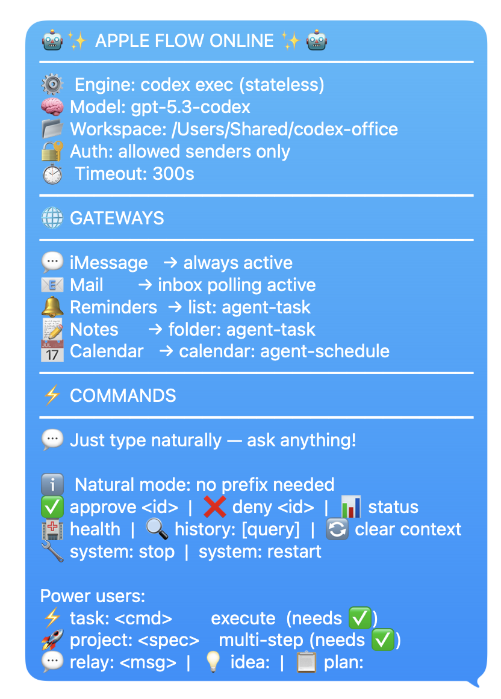 | 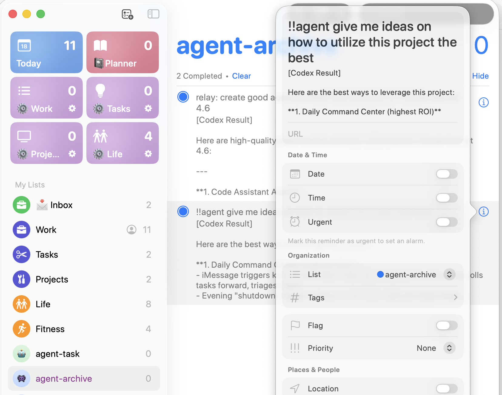 |

| AI Policy Log | Calendar Event |
|---|---|
| 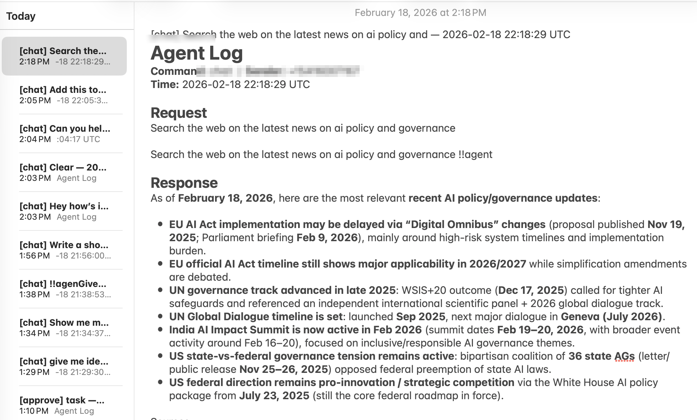 | 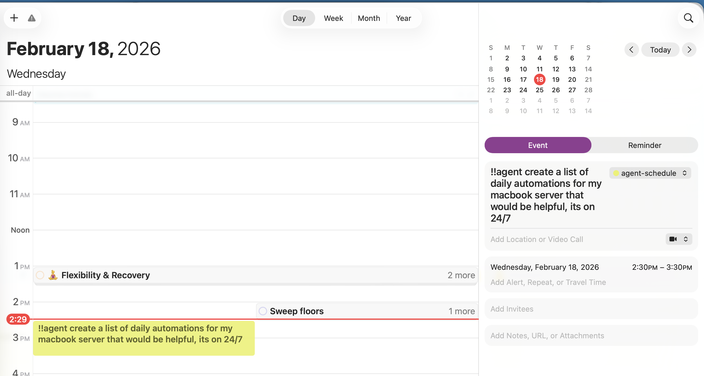 |

| Office Brainstorm |
|---|
| 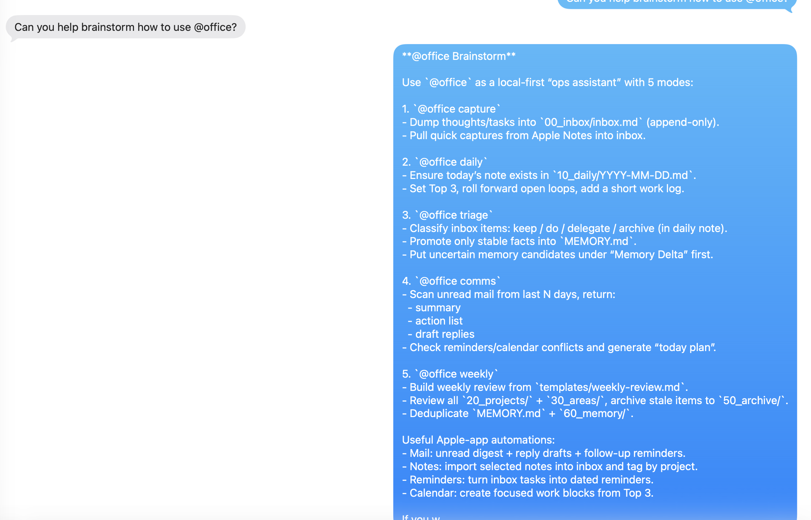 |

### Dashboard App

| Onboarding 1 | Onboarding 2 |
|---|---|
| 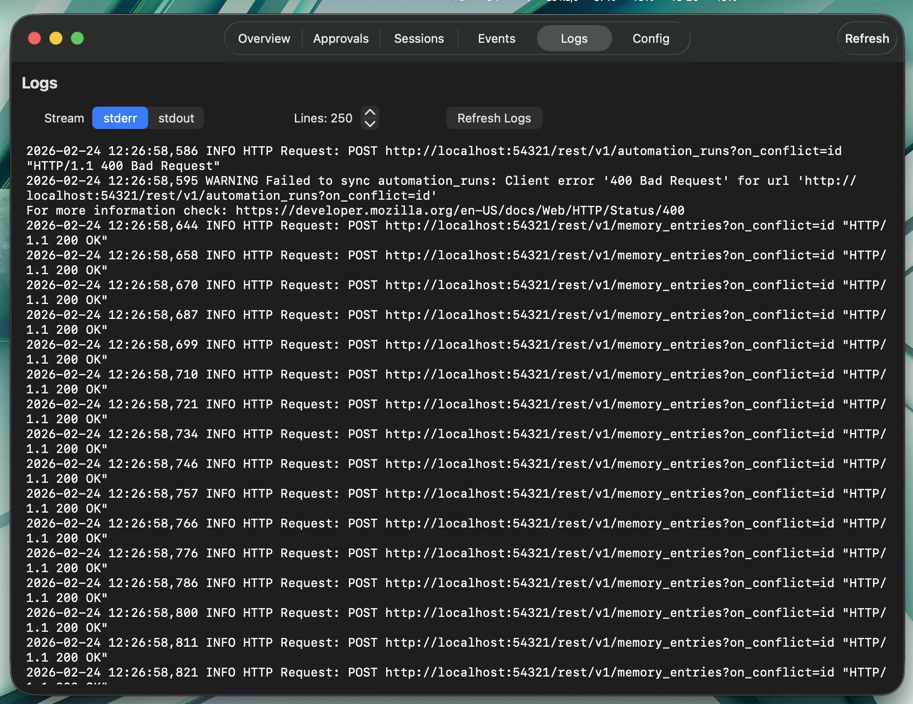 | 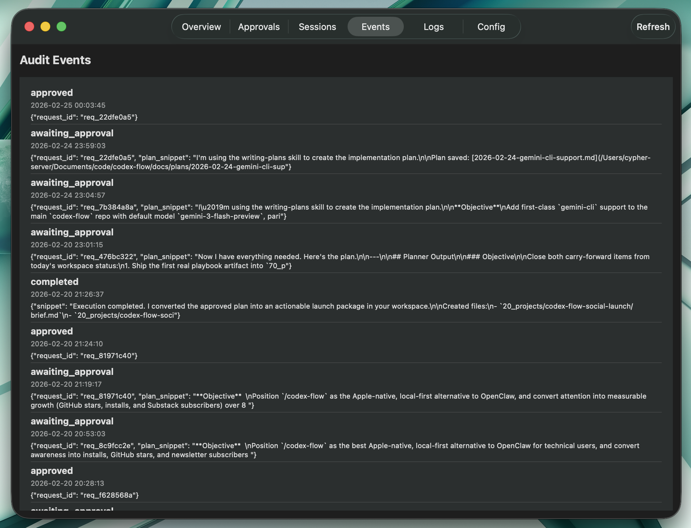 |

| Onboarding 3 | Onboarding 4 |
|---|---|
| 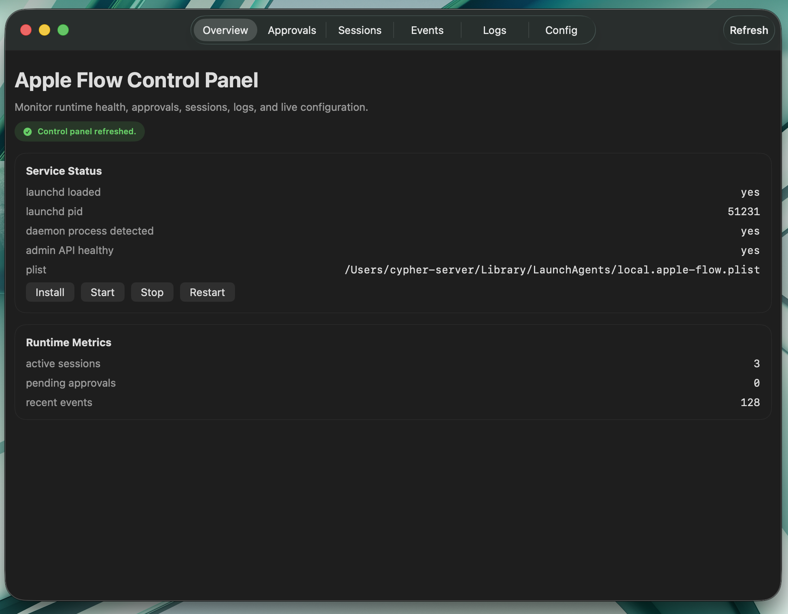 | 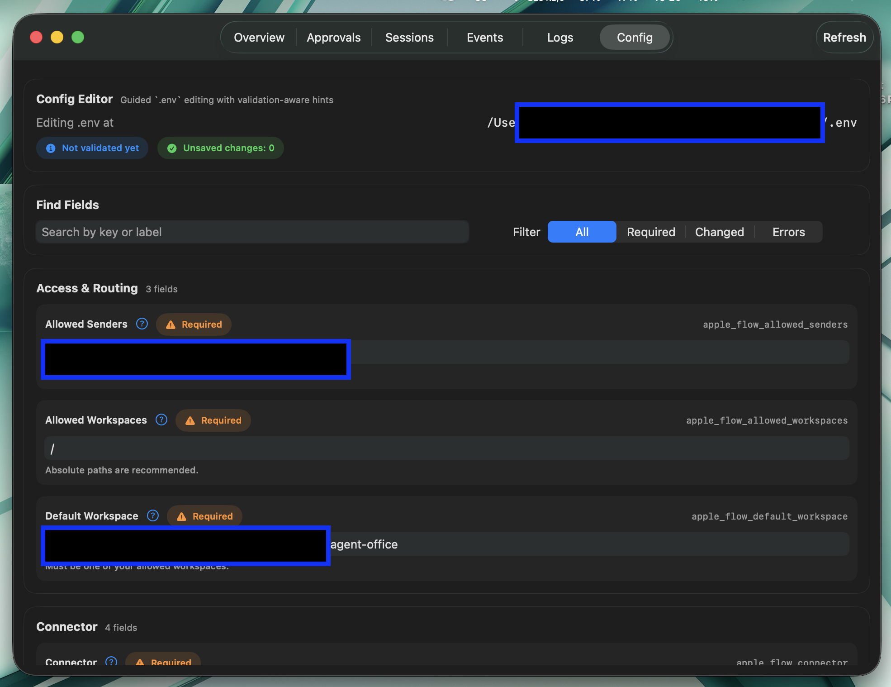 |

| Setup Configuration | Onboarding Error |
|---|---|
| 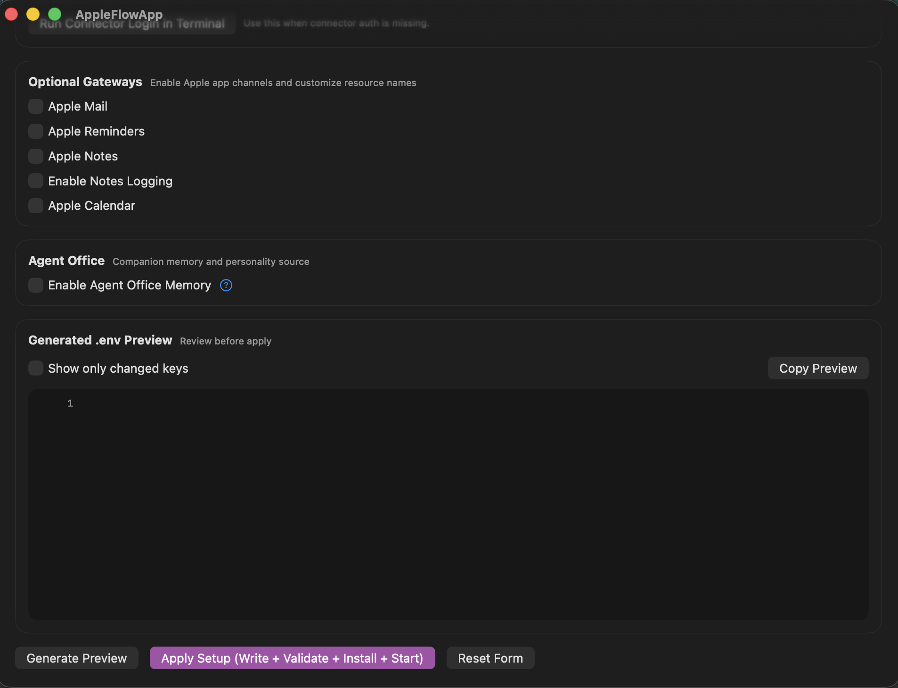 | 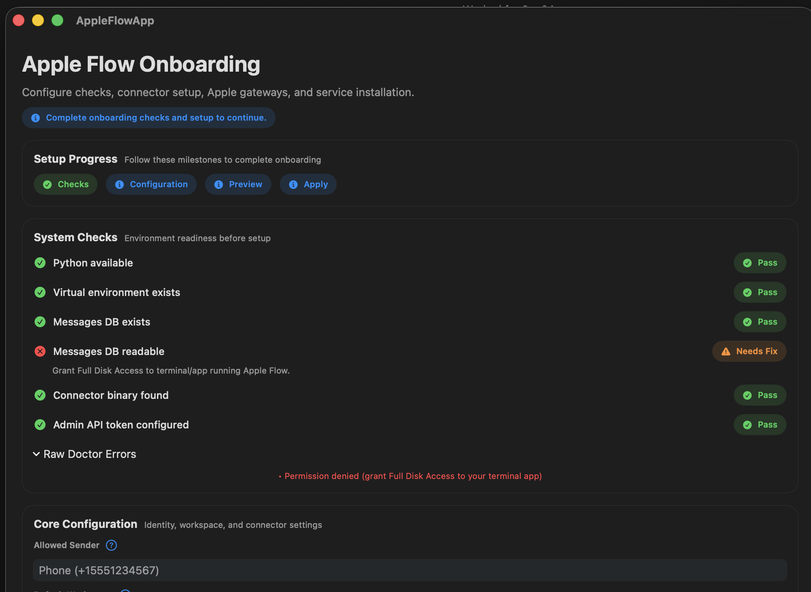 |

## Highlights (Quick Read)

- Local-first Apple-native AI automation with strong safety defaults (allowlist + approval gates + workspace boundaries).
- Multi-gateway operations across iMessage, Mail, Reminders, Notes, and Calendar with deterministic tool flows.
- New Apple Pages support for high-quality document generation from Markdown, including themes, TOC, citations, exports, and section updates.
- New Apple Numbers support for workbook creation, sheet management, row insertion semantics, and styling automation.
- Global skill packs for Codex/Claude-style workflows, including dedicated `apple-flow-pages`, `apple-flow-numbers`, `apple-flow-mail`, and `apple-flow-gateways` skills.
- Production-friendly operations with service controls, health/status tooling, and comprehensive test coverage.

## Start Here

Choose one setup path:

| Path | Best for | Time | Entry point |
|---|---|---:|---|
| **AI-guided setup (recommended)** | Most users, safest onboarding | ~10 min | [docs/AI_INSTALL_MASTER_PROMPT.md](docs/AI_INSTALL_MASTER_PROMPT.md) |
| **One-command script** | Fast local install/autostart | ~5-10 min | `./scripts/setup_autostart.sh` |
| **Manual setup** | Advanced/custom environments | ~15+ min | [docs/AUTO_START_SETUP.md](docs/AUTO_START_SETUP.md), [docs/ENV_SETUP.md](docs/ENV_SETUP.md) |

## Quick Start (AI-Guided)

### 1) Prerequisites

- macOS with iMessage signed in
- 10 minutes
- Homebrew + Python 3.11 + Node

```bash
# Install Homebrew (if needed)
/bin/bash -c "$(curl -fsSL https://raw.githubusercontent.com/Homebrew/install/HEAD/install.sh)"

# Install Python + Node
brew install python@3.11 node
```

### 2) Install One AI CLI Connector

Pick one:

- Claude CLI

```bash
curl -fsSL https://claude.ai/install.sh | bash
claude auth login
```

- Codex CLI

```bash
npm install -g @openai/codex
codex login
```

- Gemini CLI

```bash
npm install -g @google/gemini-cli
gemini auth login
```

- Cline CLI

```bash
npm install -g cline
cline auth
```

- Kilo CLI (optional advanced connector)

```bash
npm install -g @kilocode/cli
kilo auth login
```

### 3) Clone + Bootstrap

```bash
git clone https://github.com/dkyazzentwatwa/apple-flow.git
cd apple-flow
./scripts/setup_autostart.sh
```

### 4) Finalize Config with the Master Prompt

Open your AI CLI and paste:

- [docs/AI_INSTALL_MASTER_PROMPT.md](docs/AI_INSTALL_MASTER_PROMPT.md)

That flow handles:

- health checks (`wizard doctor --json`)
- full `.env` generation from `.env.example`
- explicit confirmation gates before writes/restarts
- gateway resource setup (Reminders/Notes/Calendar)
- validation + service status verification

### 5) Grant Full Disk Access

1. Open `System Settings -> Privacy & Security -> Full Disk Access`
2. Add the Python binary used by Apple Flow (the setup output shows the path)
3. Enable the toggle

### 6) Smoke Test

Text yourself in iMessage:

```text
what files are in my home directory?
```

You should receive a reply within seconds.

## Setup Paths (Detailed)

### A) One-command script only

If you do not want AI-guided setup:

```bash
./scripts/setup_autostart.sh
```

If `.env` is missing, it launches `python -m apple_flow setup` to generate one.

### B) Manual setup

Edit `.env` directly:

```bash
nano .env
```

Minimum keys:

```env
apple_flow_allowed_senders=+15551234567
apple_flow_allowed_workspaces=/Users/you/code
apple_flow_default_workspace=/Users/you/code
apple_flow_connector=claude-cli
apple_flow_admin_api_token=<long-random-secret>
```

For Reminders-backed workflows, `apple_flow_reminders_list_name` and `apple_flow_reminders_archive_list_name` must be plain top-level list names such as `agent-task` and `agent-archive`. Sectioned lists, grouped lists, nested paths, and Accessibility-backed fallbacks are not supported.

Then validate and restart:

```bash
python -m apple_flow config validate --json --env-file .env
python -m apple_flow service restart --json
python -m apple_flow service status --json
```

### Browser Dashboard

The admin service also serves a lightweight Agent Office dashboard for phone and browser access.

Open:

```text
http://localhost:8787/dashboard
```

If `apple_flow_admin_api_token` is set, the first visit shows a small dashboard login form. Enter the same admin token there once and the browser receives a dashboard-only `HttpOnly` cookie scoped to `/dashboard`.

Practical notes:
- The dashboard is read-heavy and focused on `agent-office`, companion state, inbox, memory, and logs.
- `Mute` / `Unmute` companion are the only built-in dashboard actions in v1.
- The dashboard cookie is scoped to `/dashboard`, so it does not unlock the broader admin API surface.
- Over Tailscale, use your Mac's Tailscale IP or MagicDNS hostname with port `8787`, for example `http://your-mac-name.tailnet.ts.net:8787/dashboard`.

## Core Commands

| Command | What it does |
|---|---|
| `<anything>` | Natural chat |
| `idea: <prompt>` | Brainstorming |
| `plan: <goal>` | Plan only (no changes) |
| `task: <instruction>` | Mutating task (approval required) |
| `project: <spec>` | Multi-step task (approval required) |
| `approve <id>` / `deny <id>` / `deny all` | Approval controls |
| `status` / `status <run_or_request_id>` | Run/request status |
| `health` | Daemon health |
| `history: [query]` | Message history |
| `usage` | Usage stats |
| `help` | Help + practical tips |
| `system: mute` / `system: unmute` | Companion controls |
| `system: stop` / `system: restart` / `system: recycle helpers` / `system: maintenance` / `system: kill provider` | Runtime controls |
| `system: cancel run <run_id>` | Cancel one run |
| `system: killswitch` | Kill all active provider processes |

### Multi-workspace routing

Prefix with `@alias`:

```text
task: @healer run the test suite
task: @web-app deploy to staging
@api show recent errors
```

### File references with aliases

Define file aliases in `.env` via `apple_flow_file_aliases` and reference them in prompts with `@f:<alias>`.

```text
plan: summarize @f:context-bank
task: review @f:runbook and propose updates
```

## Optional Integrations

All optional gateways are off by default.

Trigger behavior:

- Default trigger tag is `!!agent`
- For Mail/Reminders/Notes/Calendar, only items containing that tag are processed
- Tag is stripped before prompt execution
- Configure via `apple_flow_trigger_tag`

Enable examples:

```env
apple_flow_enable_mail_polling=true
apple_flow_enable_reminders_polling=true
apple_flow_enable_notes_polling=true
apple_flow_enable_calendar_polling=true
```

Voice message examples:

```env
apple_flow_phone_owner_number=+15551234567
apple_flow_imessage_auto_send_image_results=owner-only
apple_flow_phone_tts_voice=
apple_flow_phone_tts_rate=180
apple_flow_phone_tts_engine=auto
apple_flow_phone_piper_model_path=/Users/you/models/en_US-amy-medium.onnx
```

Then trigger with:

```text
voice: standup starts in 10 minutes
voice-task: analyze my workspace
```

`voice:` speaks the exact text you send. `voice-task:` runs the task first, then sends both the text result and a synthesized audio copy over iMessage to the configured owner number. `apple_flow_imessage_auto_send_image_results=owner-only` also makes outbound replies auto-attach intentional local image results for the owner instead of echoing bare file paths.

Companion + memory examples:

```env
apple_flow_enable_companion=true
apple_flow_enable_memory=true

# Canonical memory v2
apple_flow_enable_memory_v2=false
apple_flow_memory_v2_migrate_on_start=true
```

Attachment processing example:

```env
apple_flow_enable_attachments=true
apple_flow_max_attachment_size_mb=10
apple_flow_attachment_max_files_per_message=6
apple_flow_attachment_max_text_chars_per_file=6000
apple_flow_attachment_max_total_text_chars=24000
apple_flow_attachment_enable_image_ocr=true
apple_flow_attachment_enable_audio_transcription=true
apple_flow_attachment_audio_transcription_command=whisper
apple_flow_attachment_audio_transcription_model=turbo
```

When enabled, Apple Flow extracts prompt context from iMessage attachments (text/code files, PDFs, images via OCR when available, Office files like `.docx/.pptx/.xlsx`, and audio voice notes via local Whisper CLI transcription) and includes that context in chat, planning, and approval execution flows.

If an inbound iMessage is just a voice note, Apple Flow now transcribes it, turns it into a synthetic `voice-task:` request, and replies with both text plus a spoken TTS follow-up. Install a local `whisper` CLI for STT, similar to how `pdftotext` and `tesseract` are used for other attachment types.

Helper maintenance example:

```env
apple_flow_enable_helper_maintenance=true
apple_flow_helper_maintenance_interval_seconds=900
apple_flow_helper_recycle_idle_seconds=600
apple_flow_helper_recycle_max_age_seconds=3600
apple_flow_watchdog_poll_stall_seconds=60
apple_flow_watchdog_inflight_stall_seconds=300
apple_flow_watchdog_event_loop_lag_seconds=5
apple_flow_watchdog_event_loop_lag_failures=3
```

When enabled, Apple Flow runs a lightweight maintenance check on a timer, soft-recycles stale helpers when the daemon is idle, and exposes forward-progress watchdog telemetry through `health` and the admin API. You can also trigger the same path manually with `system: recycle helpers` or `system: maintenance`.

See full settings in [docs/ENV_SETUP.md](docs/ENV_SETUP.md).

## AI Backends

| Connector | Key |
|---|---|
| Claude CLI | `apple_flow_connector=claude-cli` |
| Codex CLI | `apple_flow_connector=codex-cli` |
| Gemini CLI | `apple_flow_connector=gemini-cli` |
| Cline CLI | `apple_flow_connector=cline` |
| Kilo CLI | `apple_flow_connector=kilo-cli` |
| Ollama (native) | `apple_flow_connector=ollama` |

Notes:

- `codex-cli`, `claude-cli`, and `gemini-cli` run stateless commands.
- `cline` is agentic and supports multiple providers.
- `kilo-cli` is supported as a connector, but setup wizard `generate-env` currently validates `claude-cli`, `codex-cli`, `gemini-cli`, `cline`, and `ollama`. For `kilo-cli`, set connector fields via manual config write after generation.
- `ollama` uses a native HTTP connector (`/api/chat`) with default model `qwen3.5:4b`.

## Recommended Bring-Up

Keep initial setup narrow so polling is easy to verify:

1. Start with iMessage only and confirm `apple-flow service status --json` reports the daemon, Messages DB access, and active polling.
2. Enable one Apple gateway at a time after polling is stable.
3. Turn on Companion, memory, follow-ups, and ambient scanning last.

## Optional macOS App

A local Swift onboarding/dashboard app is bundled:

- app bundle: `dashboard-app/AppleFlowApp.app`
- distributable zip: `dashboard-app/AppleFlowApp-macOS.zip`

Or build/export from source docs: [docs/MACOS_GUI_APP_EXPORT.md](docs/MACOS_GUI_APP_EXPORT.md)

## Security Defaults

- Sender allowlist enforcement
- Workspace restrictions
- Approval workflow for mutating tasks
- Approval sender verification
- Rate limiting
- Read-only iMessage DB access
- Duplicate outbound suppression

Details: [SECURITY.md](SECURITY.md)

## Audit Logging

Apple Flow now supports a CSV-first analytics log while keeping SQLite as the canonical audit store.

- Canonical audit source: SQLite `events` table (`/audit/events` endpoint).
- Analytics mirror: `agent-office/90_logs/events.csv` (append-only, one row per event).
- Human-readable markdown mirror: disabled by default.

Relevant `.env` settings:

- `apple_flow_enable_csv_audit_log=true`
- `apple_flow_csv_audit_log_path=agent-office/90_logs/events.csv`
- `apple_flow_csv_audit_include_headers_if_missing=true`
- `apple_flow_enable_markdown_automation_log=false`

## Service Management

```bash
launchctl start local.apple-flow
launchctl stop local.apple-flow
launchctl list local.apple-flow
tail -f logs/apple-flow.err.log
./scripts/uninstall_autostart.sh
```

## Documentation

- [docs/README.md](docs/README.md)
- [docs/PROJECT_REFERENCE.md](docs/PROJECT_REFERENCE.md)
- [docs/AI_INSTALL_MASTER_PROMPT.md](docs/AI_INSTALL_MASTER_PROMPT.md)
- [docs/AUTO_START_SETUP.md](docs/AUTO_START_SETUP.md)
- [docs/QUICKSTART.md](docs/QUICKSTART.md)
- [docs/ENV_SETUP.md](docs/ENV_SETUP.md)
- [docs/SKILLS_AND_MCP.md](docs/SKILLS_AND_MCP.md)
- [docs/MACOS_GUI_APP_EXPORT.md](docs/MACOS_GUI_APP_EXPORT.md)
- [CHANGELOG.md](CHANGELOG.md)
- [CONTRIBUTING.md](CONTRIBUTING.md)

## Contributing

See [CONTRIBUTING.md](CONTRIBUTING.md).

## License

MIT — see [LICENSE](LICENSE).
