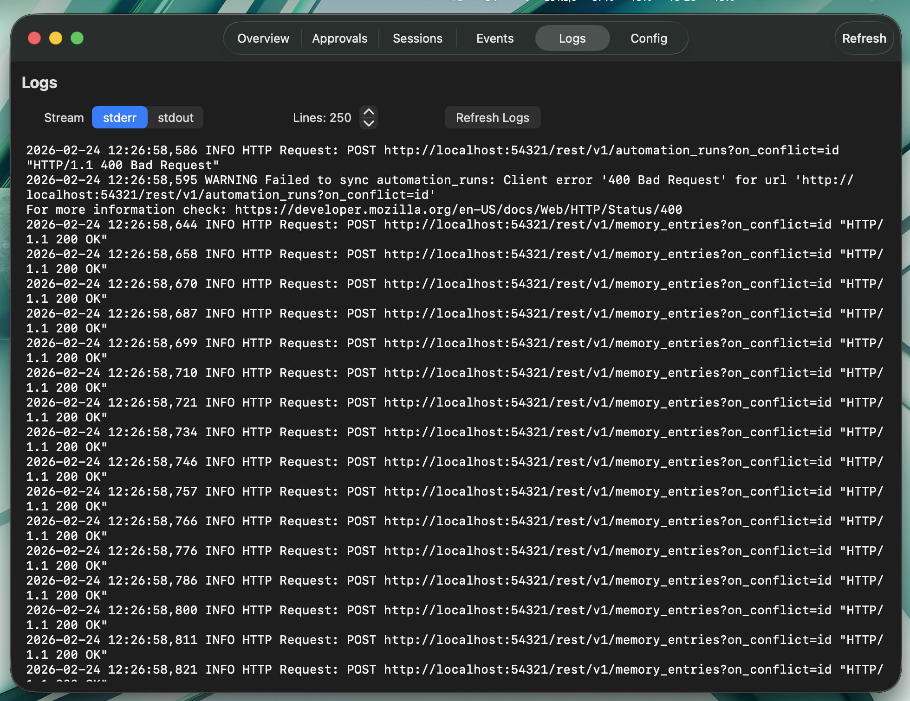
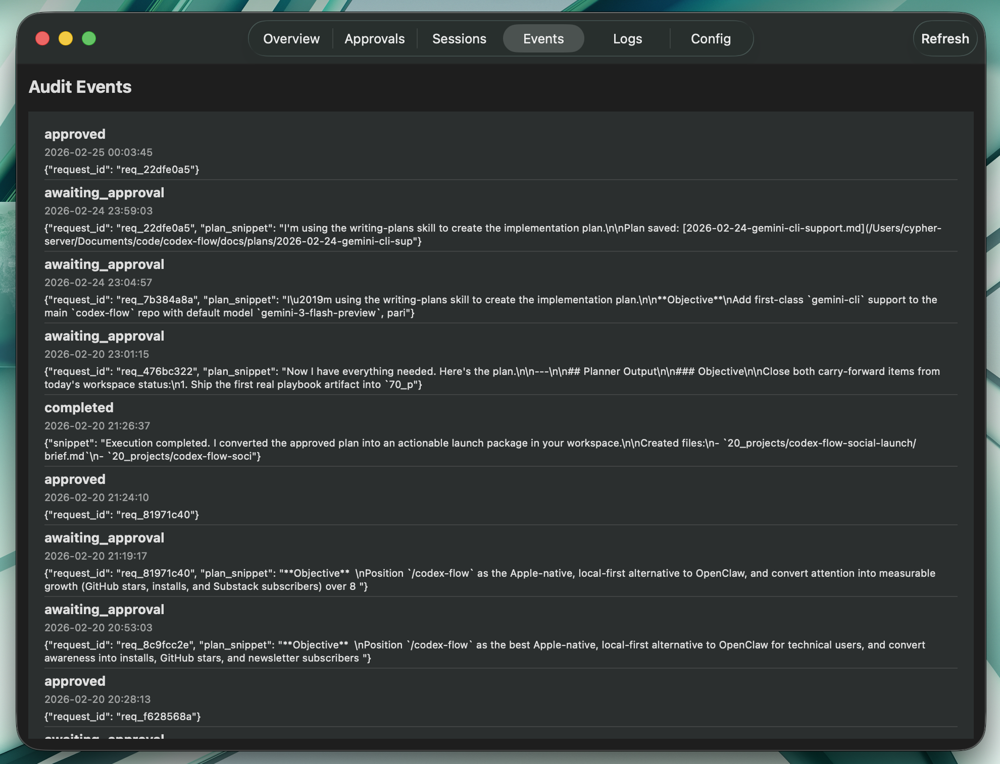
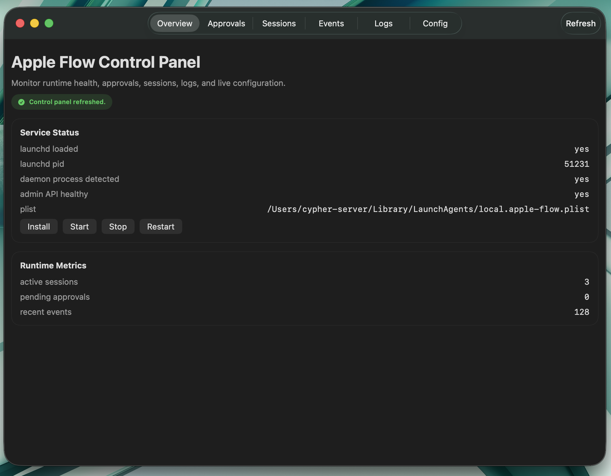
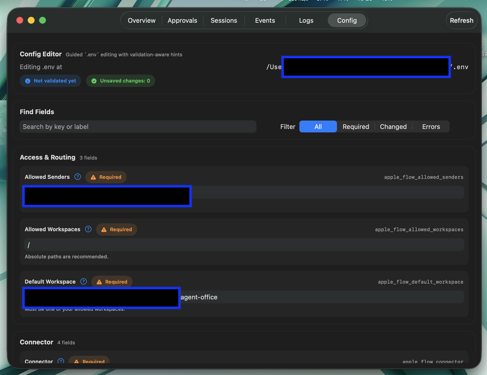
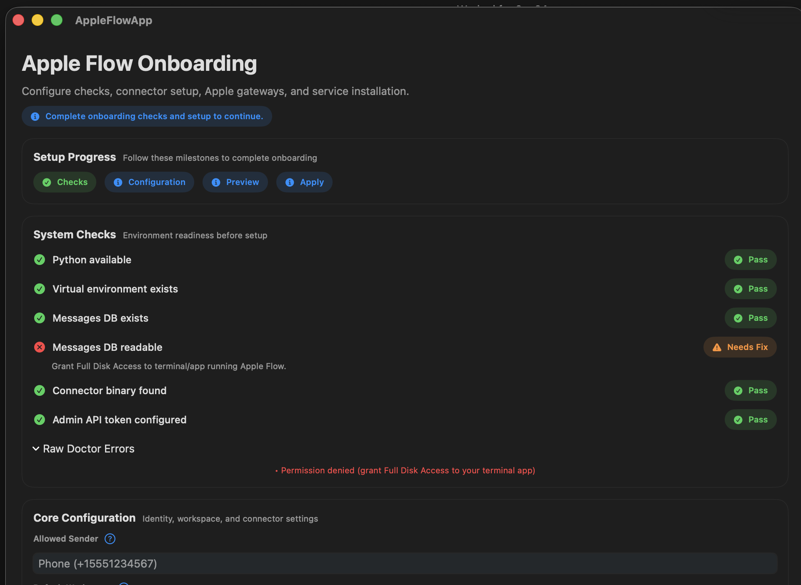

# AppleFlowApp (Swift macOS Onboarding + Dashboard)

Apple Flow includes an optional native macOS Swift app for:

- guided onboarding and setup checks
- `.env` preview/apply workflow
- runtime operations (service controls, approvals, sessions, events, logs, config)

The app source lives in `apps/macos/AppleFlowApp`.

## Screenshots

| Audit Events Timeline | Log Stream Viewer |
|---|---|
|  |  |

| Control Panel Overview | Config Editor |
|---|---|
|  |  |

| Onboarding Error (Doctor Checks) | |
|---|---|
|  | |

## Build and Run

From repo root:

```bash
# Open in Xcode
./apps/macos/AppleFlowApp/scripts/open_in_xcode.sh

# Build + export standalone app and zip to dist/
./apps/macos/AppleFlowApp/scripts/export_app.sh

# Launch exported app (builds first if missing)
./apps/macos/AppleFlowApp/scripts/run_standalone.sh
```

Artifacts produced by export:

- `dist/AppleFlowApp.app`
- `dist/AppleFlowApp-macOS.zip`

## Prebuilt Bundle in Repository

The repository may include a prebuilt copy under `dashboard-app/`:

- `dashboard-app/AppleFlowApp.app`
- `dashboard-app/AppleFlowApp-macOS.zip`

Use the scripts above to rebuild from source when needed.
